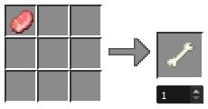
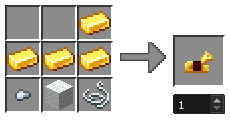

# Jim's Custom Recipes

Minecraft data pack for a handful of custom recipes.

To install, put the [JCR.zip](JCR.zip) file in the [`datapacks`](https://minecraft.wiki/w/Data_pack) folder of your Minecraft world.

## Bone

## String

Any type of wool.

## Name Tag

## Saddle

## Horse Armor

Any type of wool.
